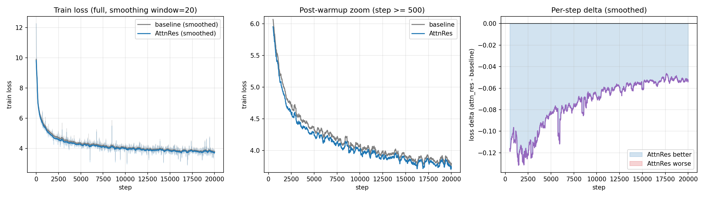

# Block Attention Residuals (Kimi Team, 2026) — torchtitan reference implementation

> **Status (2026-05-08).** RFC [pytorch/torchtitan#3029](https://github.com/pytorch/torchtitan/issues/3029)
> filed; upstream merge gated on Kimi K3 release. **This fork is the canonical
> reference implementation until then.** Independent reproduction of paper
> Table 1 (loss-delta) on a 174M Llama3 dense run + first public PP cross-stage
> caching adapter for AttnRes under torchtitan's `Interleaved1F1B` schedule
> (paper Section 4.1), with downstream extensions to Kimi-Linear MoE
> pretraining and multimodal VLM training.

*AttnRes consistently below baseline at every milestone (Δ −0.05 to −0.13),
reproducing the paper's Table 1 trend on a single-GPU FSDP A/B at matched
shape and hyperparameters. See `phase2_attnres_baseline_loss/` for the playbook.*

This repo is the project logbook / playbook / RFC drafts for an independent,
end-to-end implementation of **Block Attention Residuals**
([Kimi Team, arXiv:2603.15031](https://arxiv.org/abs/2603.15031)) inside
[pytorch/torchtitan](https://github.com/pytorch/torchtitan). The actual code
lives in the fork submodule:

- **Fork:** [`QIU023/torchtitan@attention_residual_dev`](https://github.com/QIU023/torchtitan/tree/attention_residual_dev)
- **Experiments:** `torchtitan/experiments/attn_res/` (dense Llama3 + DSv3 MoE-MLA flavors) and `torchtitan/experiments/kimi_linear/` (Kimi Linear KDA+MLA+AttnRes port)
- **Inference fork:** [`QIU023/sglang@attention_residual_inference`](https://github.com/QIU023/sglang/tree/attention_residual_inference) — Block AttnRes overlay for SGLang (Kimi-Linear + Qwen3, with CUDA Graph integration)
- **RFC:** [pytorch/torchtitan#3029](https://github.com/pytorch/torchtitan/issues/3029)

## Algorithm

Block AttnRes replaces fixed residual accumulation with softmax attention over
block outputs, using a per-layer zero-initialized pseudo-query. Layers are
partitioned into `N` blocks; standard residuals run inside each block, attention
fires only at block boundaries. Cross-stage traffic is `O(N d)` instead of
`O(L d)` — making the algorithm PP-friendly at `N ≈ 8`.

Paper headline: AttnRes ≈ baseline × 1.25 effective compute at matched param
count. The single-GPU 174M dense Llama3 reproduction below is consistent with
that range.

## What's been done

| Phase | Scope | Status |
| --- | --- | --- |
| **Phase 0** | Framework selection (torchtitan vs Megatron-LM); PP extension-point survey | ✅ done |
| **Phase 2** | 174M dense Llama3 single-GPU FSDP A/B (baseline vs AttnRes), 20 k steps on C4-en | ✅ done — RFC evidence |
| **Phase 3** | Cross-stage caching adapter for `Interleaved1F1B`; 4-GPU PP=4 V=2 naive-vs-adapter parity | ✅ done — see `phase3_attnres_pp_integration/` |
| **Phase 4a** | Kimi Linear (KDA + MLA + dense/MoE) torchtitan port + AttnRes wrapper | ✅ done |
| **Phase 4b** | 436M Kimi Linear FSDP baseline overnight, 12.5 k steps | ✅ done |
| **Phase 4c** | Kimi Linear + AttnRes + PP cache adapter, 12.5 k step run | ✅ done |
| **Phase 5** | Distillation / multimodal scaffolding using the 12.5 k ckpt | scaffolded; not pretraining-quality (see [`docs/multi_modal_idea.md`](./docs/multi_modal_idea.md)) |

The 436M Kimi Linear ckpt is severely under-pretrained relative to the paper's
119 B-token Table 2 budget (~0.35% of paper-spec tokens). It is sufficient as
an **architecture-validation backbone** — end-to-end forward/backward, AttnRes
gradient flow under PP, projector training dynamics, ckpt compatibility — but
not as a downstream-benchmark backbone. Read [`docs/multi_modal_idea.md`](./docs/multi_modal_idea.md)
for the realistic framing.

## Phase 2 single-GPU result (174M dense Llama3, C4-en, FSDP)

Same shape, same hyperparameters; only `model_spec` differs:

| step | baseline | attn_res | Δ |
|---:|---:|---:|---:|
| 500   | 6.1412 | 6.0146 | −0.1265 |
| 5000  | 4.3575 | 4.2696 | −0.0879 |
| 10000 | 4.3235 | 4.2192 | −0.1043 |
| 15000 | 3.7368 | 3.6861 | −0.0507 |

Plot: [`phase2_attnres_baseline_loss/runs/comparison.png`](./phase2_attnres_baseline_loss/runs/comparison.png).

## Phase 3 PP cross-stage caching adapter (4-GPU PP=4 V=2, 1000 steps)

PP=4 V=2 with `layers_per_stage=2` against the 16-layer / 8-block
`llama3_175m_attn_res_L16_n8` flavor — every stage boundary is a block
boundary, so the cache adapter is exercised at every transition.

| variant | step 1000 loss |
|---|---:|
| naive (no cache) seed A | 6.37720 |
| naive (no cache) seed B | 6.37720 + small noise |
| adapter (with cache) seed A | 6.34968 |

`|Δ_naive→adapter| max 0.06` stays inside the `|Δ_naive→naive|` nondeterminism
band (max 0.13) over the same horizon. Memory accounting matches the design
(+260 MB cache on rank 3 for 175M at M=4 mb). 41/41 CPU unit tests pass.

What is **not** yet shown:
- ≥ 5 k step PP horizon stability,
- PP=8 scale-up,
- AttnRes-vs-baseline delta preservation under PP,
- the 1.5–2 B PCIe-overhead headline plot.

These are the natural next experiments — gated on multi-node access, not on
the algorithm or adapter.

## Repository layout

| Path | What it is |
| --- | --- |
| [`ROOT_PLAN.md`](./ROOT_PLAN.md) | Full phased project plan (hardware, budget, risk register, references to Kimi infra notes) |
| [`RFC_DRAFT_v3.md`](./RFC_DRAFT_v3.md) | RFC text as posted to issue #3029 |
| [`phase2_attnres_baseline_loss/`](./phase2_attnres_baseline_loss/) | Single-GPU FSDP playbook + results (`runs/comparison.png`) |
| [`phase3_attnres_pp_integration/`](./phase3_attnres_pp_integration/) | PP playbook: adapter design notes, fake-PG smoke, 4-GPU launchers, naive-vs-adapter compare plots |
| [`phase4_kimi_attnres_lm_pretrain/`](./phase4_kimi_attnres_lm_pretrain/) | Kimi Linear port + 12.5 k step FSDP / PP-adapter overnight runs |
| [`docs/`](./docs/) | Cross-cutting design notes (multimodal idea, etc.) |
| [`reports/`](./reports/) | Written reports (en + zh) for portfolio walkthroughs |
| [`Attention-Residuals/`](./Attention-Residuals/) | Kimi's reference implementation + paper PDF (vendor copy) |
| [`torchtitan/`](./torchtitan) | Submodule pointing at the fork's `attention_residual_dev` branch |
| [`SETUP_OMC.md`](./SETUP_OMC.md) | Optional: oh-my-claudecode plugin install + project-local skills (`.omc/skills/`) for the recurring 8-GPU / submodule / NCCL-trace recipes |

## Why fork-as-canonical (instead of merging)

Kimi Team's K3 release is the natural upstream merge window — the model series
that productionizes AttnRes will land alongside it. Until then:

- the algorithm is reproduced and documented in the open,
- the PP integration story is concrete (adapter + 4-GPU evidence),
- anyone wanting to build on AttnRes inside torchtitan can pull this fork
  rather than re-implement from the paper.

This repo is the entry point. Track 1 (single-GPU dense) backs the RFC; Track 2
(PP adapter) is the contribution that's hard to reconstruct from the paper
alone; Track 3 (Kimi Linear KDA+MLA+MoE+AttnRes) is the production-aligned
scaffolding for the K3-era follow-up.

## Not in this repo

- The torchtitan fork itself (cloned as a submodule under `torchtitan/`).
- TensorBoard event files, optimizer ckpts, training shards — gitignored.
  Only comparison plots and log tails are committed as evidence.

## Disk discipline (operational rules)

Lessons from a 2026-05-03 disk-full incident that wasted ~7 GPU-hours
(see `phase6_upstream_pr_prep/CHECKPOINT_RULES.md` for the full postmortem and the
launcher patch). The rules:

1. **Alignment + NCCL trace runs do NOT keep checkpoints.** A 500-step
   alignment or a 50-step trace tier writes a ~15 GB DCP shard that is
   never re-loaded — pure disk drag. Pass `CHECKPOINT_ENABLED=0` to
   `phase6_upstream_pr_prep/launch_8gpu_mm.sh`.

2. **Long pretrain runs use `keep_latest_k=2 interval=500`.** Two
   rolling checkpoints, no historical accumulation. If you want to
   preserve a milestone, copy it to a separate dir before the rolling
   counter overwrites it.

3. **Trace data is the deliverable for short runs.** What gets
   committed: `tb/events.out.tfevents.*` (loss curve), `recipe.json`
   (mesh + recipe), and `tier_*_trace/{nccl-rank-*.log,
   collective_summary.csv}` packaged into `phase7_nccl_traffic_catalog/archive/*.tar.gz`
   via `phase7_nccl_traffic_catalog/pack_traces.sh`. The model state itself is throwaway.

4. **Compress + commit + push immediately after each run.**
   `phase7_nccl_traffic_catalog/auto_publish_watcher.sh` polls run logs and fires
   `phase7_nccl_traffic_catalog/publish_archive.sh` at known step milestones (alignment
   step:500, tier tier_b/a step:50/100, pretrain step:1000/3000/5000).
   Push happens automatically — no manual archive management.

5. **Pre-launch disk check.** Before any run, `df -h /` should report
   ≥ 30 GB free. Below that, do `rm -rf
   phase5_vlm_multimodal_sft/runs/8gpu_*_seed*/checkpoint/` (alignment ckpts that
   shouldn't have existed in the first place) before launching.

## Development methodology

This project was built with **extensive AI pair-programming** (Claude Code, both
local and cloud-hosted long-context sessions). Architectural direction, phase
scoping, design trade-offs, and final code review are mine; AI-assisted commits
are explicitly tagged via `Co-Authored-By` in commit messages.

Why this matters for the project: each phase has a clear scientific or
engineering question, validated outcomes, and an honest writeup of what worked
and what did not (e.g., `phase5_distillation_deprecated/` preserves a negative
KD result; the v8/v9 multimodal pretrain ckpt is explicitly framed as
architecture-validation grade, not pretraining-grade). The commit log is verbose
by design — every non-trivial design decision has a corresponding commit with
rationale, and reproducible artifacts (loss curves, alignment plots, NCCL
traces) accompany each phase.

## Author

[@QIU023](https://github.com/QIU023) — open issues / discussions on this repo
for technical questions, or reach out via the LinkedIn link on my GitHub
profile.
