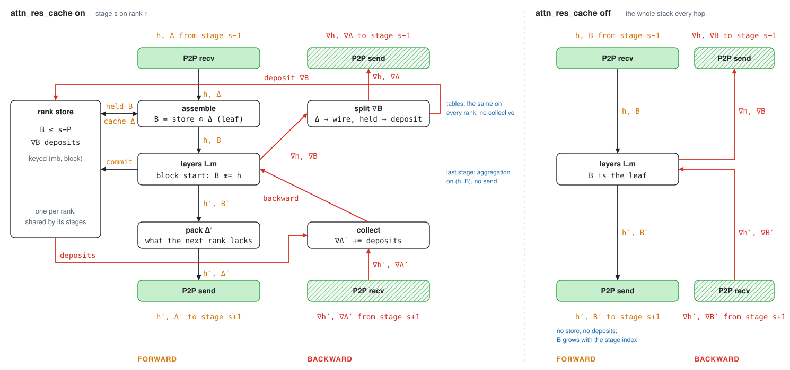

# Pipeline parallelism for the block attention residual

Every Kimi K3 layer attends over the block stack, so under pipeline parallelism the stack crosses every stage boundary with the hidden state, and the final aggregation runs only on the stage that owns `lm_head`. Sending the whole stack on every hop is correct and simple; with the rank cache on, a hop carries only the blocks the receiving rank has not seen. The stage, the routing tables and the rank store are in [`stage.py`](stage.py) and [`layout.py`](layout.py); [`__init__.py`](__init__.py) builds them on core's split.

## Overview

The diagram shows one stage on one rank with `attn_res_cache` on, and the same stage with it off. Forward in black, backward in red; the P2P receive and send are the green boxes, solid for forward and hatched for backward. Nothing else communicates: no collective runs in the transport.

`h` hidden [T, D] · `B` block stack [T, N, D] · `Δ` the blocks the next rank lacks [T, N_d, D] · `∇` gradient of

## Forward

A rank keeps every block it has seen in one store shared by its virtual stages, keyed by micro-batch and block. On entry a stage assembles the stack the model expects from the store and the received `Δ`, as a fresh autograd leaf; the model returns the stack with its new blocks appended, the stage commits them to the store and sends on only what the next rank lacks. A block committed at stage `s` is therefore new on the wire for `P−1` hops and then held by every rank. The routing tables that say which blocks travel and which are held are a pure function of the split, computed identically on every rank.

## Backward

The gradient of the assembled leaf splits by column: the received columns go back on the wire as `∇Δ`, the held columns are deposited in the store. The stage that brought a block onto the rank collects those deposits into its own incoming gradient before its backward, and the count is checked against the tables, so a missing deposit raises instead of training quietly. The order this needs, a rank's stages running backward in decreasing index, is one every pipeline schedule provides by data dependency.

## Configurations

| Config | A hop carries | A rank keeps | Gradient of a held block | Schedules |
|--------|---------------|--------------|--------------------------|-----------|
| `attn_res_cache` on | `h` and `Δ` | blocks committed at stages ≤ s−P, and deposits | deposited in the store, collected by the stage that brought the block | loop-style stage placement (stage s on rank s mod P) |
| `attn_res_cache` off | `h` and the whole stack `B` | nothing | returns on the wire inside `∇B` | any |
