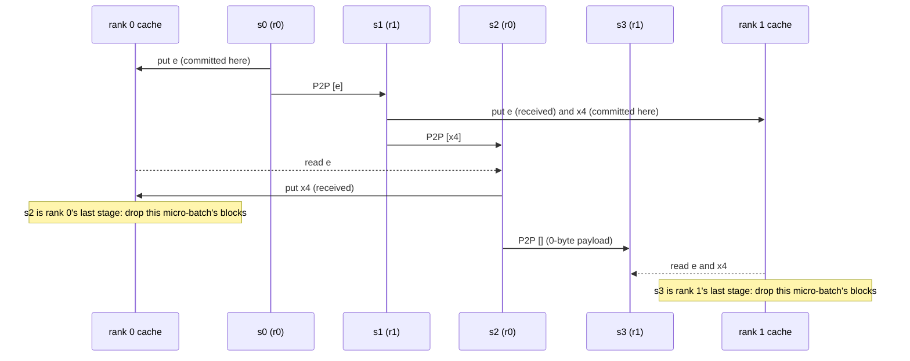
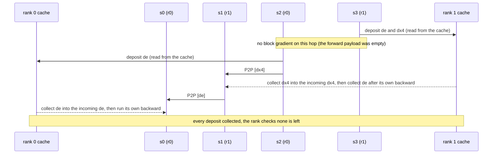

# Edit of r3998924467 (per-stage tables): the posted text, plus two sequence diagrams and the backward release

For the user to paste as the NEW BODY of the already posted comment r3998924467 (edit, not a new reply). Changes against
the posted text: two mermaid sequence diagrams (forward, backward) for the 2 blocks x 4 layers pp2 x vp2 example, inserted
before "In conclusion", and point 1 now says when the autograd-held stack and activations are freed (each stage's
`fwd_cache`, popped in its backward). Everything else is the posted text unchanged. Diagram facts from
`pp_cache_reduction_order.py 2 2 8 4` and `pipeline_stage.py` at `6e1f5e41c` (release on the rank's last stage forward;
a committed block's deposits are collected before the owner's backward, a received block's after it).
`REPLY_4312_R3998924467_RELEASE_2026-09-13.md` is superseded by this and need not be posted.

--- PASTE BEGIN ---

Hi Tianyu @tianyu-l , here is the per-stage view, where the cache matters.

Your example, 2 blocks x 4 layers, with pp2 x vp2 (Interleaved1F1B: global stage s runs on rank s % 2) and the split core generates. `e` is the embedding (stack entry 0), `x4` block 1's result (entry 1); block 2's result is consumed by the output aggregation and never enters the stack.

| global stage (rank, virtual) | layers | Block AttnRes stored stack | PP Comm, fwd (no cache) | PP Comm, fwd (cache) | already cached |
| --- | --- | --- | --- | --- | --- |
| s0 (r0, v0) | emb, 0-1 | e | - | - | - |
| s1 (r1, v0) | 2-4 | x4 | s0 -> [e] | s0 -> [e] | - |
| s2 (r0, v1) | 5-6 | - | s1 -> [e, x4] | s1 -> [x4] | [e] |
| s3 (r1, v1) | 7, head | - | s2 -> [e, x4] | s2 -> [] (empty payload) | [e, x4] |

Stack entries sent per micro-batch in forward: 5 with the cache off, 2 with it on. The hidden state travels on every hop and is not listed; an empty entry list still posts a 0-byte send / recv.

Backward, s3 -> s0 for each micro-batch:

| global stage (rank, virtual) | PP Comm, bwd (no cache) | PP Comm, bwd (cache) | deposits into the rank cache | collects from the rank cache |
| --- | --- | --- | --- | --- |
| s3 (r1, v1) | - | - | [de, dx4] | - |
| s2 (r0, v1) | s3 -> [de, dx4] | no op (empty payload) | [de] | - |
| s1 (r1, v0) | s2 -> [de, dx4] | s2 -> [dx4] | - | s3 stored: [de, dx4] |
| s0 (r0, v0) | s1 -> [de] | s1 -> [de] | - | s2 stored: [de] |

Gradient entries sent per micro-batch in backward: 5 with the cache off, 2 with it on. The hidden state's gradient travels on every hop and is not listed; an empty payload needs no gradient, so nothing is sent for it.

One micro-batch of that example with the cache on. Forward (the hidden state travels on every hop and is not drawn):

Backward (each stage frees its own saved stack and activations when its backward of the micro-batch finishes):

In conclusion:
1. Forward: a stage puts each entry it adds or receives into its rank's cache (a detached view of the stack, no copy). The rank drops a micro-batch's entries right after its last stage's forward for that micro-batch (stage 2 on rank 0, stage 3 on rank 1). What backward needs is held by autograd as usual, not by the cache: each stage keeps its own stack (assembled from the payload and the cache) and its saved activations in the pipeline's `fwd_cache`, and frees them in its own backward of that micro-batch (s3 first, s0 last), the same as with the cache off.
2. Backward: a stage that read an entry from the cache does not send that entry's gradient anywhere; it deposits it in the rank's cache (stage 3: `e` and `x4`; stage 2: `e`). The stage that put the entry on the rank adds the deposit to its own gradient before sending upstream (stage 1 collects both on rank 1, stage 0 collects `e` on rank 0). So a deposit lives from the reader's backward to the owner's backward of the same micro-batch, and the rank checks none is left after its first stage's backward.
3. Inside a stage, what is saved and recomputed is the same as without PP: with the default `SelectiveAC` each layer is one checkpoint region, and the residual reads are recomputed in that layer's backward.

A hop carries only the entries the receiving rank has not seen yet. The same with 4 blocks x 4 layers, pp4 x vp4 (stage s on rank s % 4; `x4`, `x8`, `x12` = the results of blocks 1-3):

| global stage (rank, virtual) | layers | Block AttnRes stored stack | PP Comm, fwd (no cache) | PP Comm, fwd (cache) | already cached |
| --- | --- | --- | --- | --- | --- |
| s0 (r0, v0) | emb, 0 | e | - | - | - |
| s1 (r1, v0) | 1-2 | - | s0 -> [e] | s0 -> [e] | - |
| s2 (r2, v0) | 3 | - | s1 -> [e] | s1 -> [e] | - |
| s3 (r3, v0) | 4 | x4 | s2 -> [e] | s2 -> [e] | - |
| s4 (r0, v1) | 5 | - | s3 -> [e, x4] | s3 -> [x4] | [e] |
| s5 (r1, v1) | 6 | - | s4 -> [e, x4] | s4 -> [x4] | [e] |
| s6 (r2, v1) | 7 | - | s5 -> [e, x4] | s5 -> [x4] | [e] |
| s7 (r3, v1) | 8 | x8 | s6 -> [e, x4] | s6 -> [] (empty payload) | [e, x4] |
| s8 (r0, v2) | 9 | - | s7 -> [e, x4, x8] | s7 -> [x8] | [e, x4] |
| s9 (r1, v2) | 10 | - | s8 -> [e, x4, x8] | s8 -> [x8] | [e, x4] |
| s10 (r2, v2) | 11 | - | s9 -> [e, x4, x8] | s9 -> [x8] | [e, x4] |
| s11 (r3, v2) | 12 | x12 | s10 -> [e, x4, x8] | s10 -> [] (empty payload) | [e, x4, x8] |
| s12 (r0, v3) | 13 | - | s11 -> [e, x4, x8, x12] | s11 -> [x12] | [e, x4, x8] |
| s13 (r1, v3) | 14 | - | s12 -> [e, x4, x8, x12] | s12 -> [x12] | [e, x4, x8] |
| s14 (r2, v3) | 15 | - | s13 -> [e, x4, x8, x12] | s13 -> [x12] | [e, x4, x8] |
| s15 (r3, v3) | head | - | s14 -> [e, x4, x8, x12] | s14 -> [] (empty payload) | [e, x4, x8, x12] |

Stack entries sent per micro-batch in forward: 39 with the cache off, 12 with it on. The hidden state travels on every hop and is not listed; an empty entry list still posts a 0-byte send / recv.

Backward, s15 -> s0 for each micro-batch:

| global stage (rank, virtual) | PP Comm, bwd (no cache) | PP Comm, bwd (cache) | deposits into the rank cache | collects from the rank cache |
| --- | --- | --- | --- | --- |
| s15 (r3, v3) | - | - | [de, dx4, dx8, dx12] | - |
| s14 (r2, v3) | s15 -> [de, dx4, dx8, dx12] | no op (empty payload) | [de, dx4, dx8] | - |
| s13 (r1, v3) | s14 -> [de, dx4, dx8, dx12] | s14 -> [dx12] | [de, dx4, dx8] | - |
| s12 (r0, v3) | s13 -> [de, dx4, dx8, dx12] | s13 -> [dx12] | [de, dx4, dx8] | - |
| s11 (r3, v2) | s12 -> [de, dx4, dx8, dx12] | s12 -> [dx12] | [de, dx4, dx8] | s15 stored: [dx12] |
| s10 (r2, v2) | s11 -> [de, dx4, dx8] | no op (empty payload) | [de, dx4] | s14 stored: [dx8] |
| s9 (r1, v2) | s10 -> [de, dx4, dx8] | s10 -> [dx8] | [de, dx4] | s13 stored: [dx8] |
| s8 (r0, v2) | s9 -> [de, dx4, dx8] | s9 -> [dx8] | [de, dx4] | s12 stored: [dx8] |
| s7 (r3, v1) | s8 -> [de, dx4, dx8] | s8 -> [dx8] | [de, dx4] | s11 stored: [dx8], s15 stored: [dx8] |
| s6 (r2, v1) | s7 -> [de, dx4] | no op (empty payload) | [de] | s10 stored: [dx4], s14 stored: [dx4] |
| s5 (r1, v1) | s6 -> [de, dx4] | s6 -> [dx4] | [de] | s9 stored: [dx4], s13 stored: [dx4] |
| s4 (r0, v1) | s5 -> [de, dx4] | s5 -> [dx4] | [de] | s8 stored: [dx4], s12 stored: [dx4] |
| s3 (r3, v0) | s4 -> [de, dx4] | s4 -> [dx4] | - | s7 stored: [de, dx4], s11 stored: [de, dx4], s15 stored: [de, dx4] |
| s2 (r2, v0) | s3 -> [de] | s3 -> [de] | - | s6 stored: [de], s10 stored: [de], s14 stored: [de] |
| s1 (r1, v0) | s2 -> [de] | s2 -> [de] | - | s5 stored: [de], s9 stored: [de], s13 stored: [de] |
| s0 (r0, v0) | s1 -> [de] | s1 -> [de] | - | s4 stored: [de], s8 stored: [de], s12 stored: [de] |

Gradient entries sent per micro-batch in backward: 39 with the cache off, 12 with it on. The hidden state's gradient travels on every hop and is not listed; an empty payload needs no gradient, so nothing is sent for it.

--- PASTE END ---
