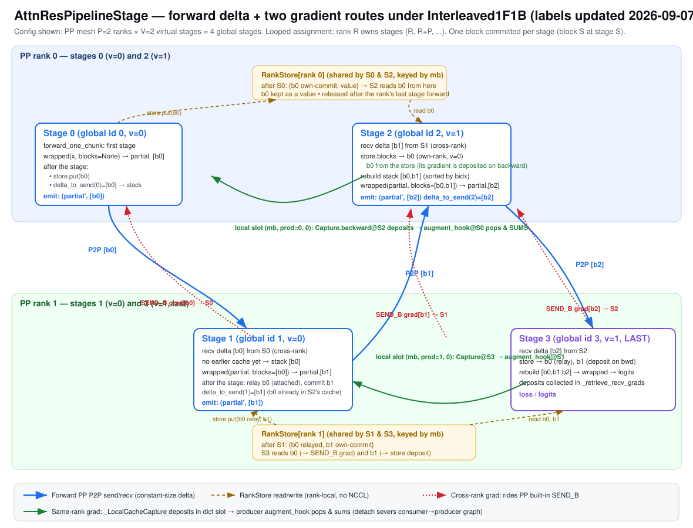

# Pipeline Parallelism for Block Attention Residuals: Design ideas and motivations

## 0. One page

```
Block AttnRes: every layer attends over ALL earlier blocks + the running partial block
    |
    v  split by layers into pipeline stages
R1  the block stack must cross every stage boundary with the hidden state
R2  the final aggregation (output_res_proj -> output_res_norm) runs only on the stage that owns lm_head
R3  the stack grows with depth; a boundary inside a block puts a partial block on the wire
    |
    +-- naive transport: send the whole stack every hop -> correct, bytes grow with the stage index
    +-- cross-stage cache (report 4.1): V virtual stages per rank; a hop carries only the delta the receiver lacks
            |
            v  three new dependencies
        (a) sender and receiver must agree on what a hop carries  -> routing tables (BlockLayoutTables), no metadata on the wire
        (b) the cache is per micro-batch                          -> a key that survives P2P (the schedule's chunk id)
        (c) a cached block's gradient must return from every later stage to the stage that committed it -> two gradient routes
            |
            v
        torch's PipelineStage knows one protocol: outputs to the next stage, gradients from it -> section 3
```

## 1. What PP / VP demand of the model and the micro-batches

| requirement | why | where |
| --- | --- | --- |
| stack crosses every boundary | each layer attends over all earlier blocks | hop payload `(hidden_TD, delta_TND)`; the model takes and returns the whole stack and knows nothing of transport |
| aggregation only on the head stage | one aggregation over the whole stack | `kimi_k3_module_fqns_per_model_part` keeps the res modules with `lm_head` |
| partial blocks on the wire | a block's first layer joins the stack before it attends | `first_layer_in_block`; a boundary at a block start needs nothing special |

Block size and stage count need not divide: K3 is 93 layers = 7 x 12 + 9, the debug flavor uses 33 so no pipeline shape divides it, and routing is built from the actual split (one `all_gather_object` of layer -> stage).

Two transports share that table behind one flag (`attn_res_cache`), and they are the A/B of the results tables: naive sends the whole stack every hop (correct, no adapter, what plain 1F1B runs); the cached delta keeps a block committed at stage $S$ on the wire for $P-1$ hops, after which every receiving rank already holds it from its virtual stage $S-P$, so the per-hop payload is bounded by the last $P-1$ stages' commits and does not grow with depth.

Micro-batch dependencies: the cache key must be the schedule's integer chunk id (`id(tensor)` fails, NCCL hands out fresh receive buffers); blocks are released after the rank's LAST virtual stage forward for that micro-batch; `Interleaved1F1B` needs micro-batches >= virtual stages and virtual stages divisible by `pp`. PP is bitwise with no-PP at one micro-batch and differs by a bf16 accumulation-order margin at many (step 1: ~4e-4 on the loss, 1.3% on grad_norm); VP adds nothing (VP=1 and VP=4 bitwise).


Figure 1. 12 layers, blocks of 4, 4 stages: the payload per hop, and the two transports.

## 2. The design: what each problem forced

The published note from the model's infrastructure team puts an adapter after the pipeline communication: it concatenates the received block with the cached ones, its backward accumulates all blocks' gradients and sends the buffer on, and the send/recv hides in interleaved steady state. It is a statement about wire bytes, and it leaves three problems to whoever implements it.

**Who holds what, without metadata on the wire.** A hop's payload depends on what the receiver already has, so both sides must agree on the columns before the first send. The layout tables are built once from the actual layer -> stage split and simulated offline on both sides; nothing about the payload travels with it.

**A micro-batch key that survives P2P.** The cache is per micro-batch, and tensor identity does not survive the transport (fresh receive buffers). The key has to come from the schedule. Subclassing the stage makes this trivial -- the chunk id is the argument of the call being overridden -- where anything outside the stage has to reach for it.

**The backward of a cached block.** A block committed at one stage is read by several later stages, so its gradient has to come back from all of them to the stage that committed it. Every general mechanism we tried failed for a reason worth stating:

1. A custom collective inside `autograd.Function.backward` deadlocks: the autograd engine is single-threaded and depth-first, the peer has not reached the matching Function, and the exchange races the schedule's own backward P2P.
2. Flushing the gradients after each micro-batch's backward deadlocks too: under interleaving, ranks reach a given micro-batch's backward at different times, so the P2P has no peer.
3. One batched exchange at step end removes the deadlock but keeps every micro-batch's graph alive until the step ends.
4. Letting the gradients ride the schedule's own backward P2P is correct across ranks and needs no new communication. It fails in exactly one case: a block a rank commits at one virtual stage and reads back from its own store at the next, where the consumer's backward walks into the producer's graph and frees it a second time.
5. `retain_graph=True` fixes that case and gives up the memory PP exists to save; the cost grows with virtual stages and micro-batches.
6. Wrapping the same-rank hand-off in autograd Functions still double-fires when both ends land in one micro-batch's backward.

What works is to stop treating the cached block as a graph at all. The store holds VALUES, so a consumer's input has no upstream graph and every forward graph is traversed once per micro-batch; the gradient is deposited in a slot keyed by (micro-batch, producing stage, commit index) and collected by the stage that brought the block onto the rank, before its own backward -- an ordering every schedule already provides, since it runs the later virtual stages' backward first. Across ranks nothing is added: the gradient rides the pipeline's own backward P2P. The tables say how many deposits each block must receive, so a lost gradient raises instead of training silently.


Figure 2. The delta window (a block is fresh on the wire for $P-1$ hops) and the two gradient routes: the pipeline's own backward P2P across ranks, a store slot within a rank.

The transport is an argument of the pipelining entry rather than an environment variable (a non-uniform export once gave ranks different topologies and hung), the layout comes from the model config, and the split is whatever the recipe asks for: an `all_gather_object` of layer -> stage replaces the even-split assumption, so an irregular model needs no divisibility.

The stage itself is a `PipelineStage` subclass. `forward_one_chunk` assembles the stack from the rank's store plus the received delta, runs the stage, keeps its commits and sends only what the next rank lacks; `backward_one_chunk` reads the gradient of the assembled stack -- a leaf the stage owns -- returns the received columns as the delta's gradient and deposits the stored columns; `_retrieve_recv_grads` collects the deposits for the blocks this rank brought in, before their producer's backward. No hooks, no custom Functions, no detach tricks: the schedule's own ordering carries the design. One core hook makes it possible, `pipeline_llm(..., stage_class=...)`. Step 1 is bitwise with a single GPU on every pp x vp cell of the irregular debug model, from 2 to 32 stages, under both transports.



Figure 3. Receive / assemble / emit per stage, and the two ranks' stores.


Figure 4. One rank, virtual stages v0 / v1, micro-batch 0: put at v0's forward, read at v1's forward, release after the rank's last virtual stage forward; deposit at v1's backward, collect before v0's backward, ordered by the schedule.

| symptom | cause | fix |
| --- | --- | --- |
| every middle stage missed its cache | `id(tensor)` as the key; NCCL fresh buffers | the schedule's chunk id |
| NCCL watchdog timeout | custom P2P inside autograd / in a flush | the gradients ride the schedule's own backward P2P |
| "backward through the graph a second time" | a same-rank cached block still attached to the producer's graph | the store holds values, not graphs |
| memory grows with virtual stages and micro-batches | `retain_graph=True` as a stop-gap for the same-rank re-read | values in the store, deposits collected by the schedule's ordering |
| ranks with different topologies hang | the transport chosen by an environment variable, exported non-uniformly | an argument of the pipelining entry |
| even split only | interleaved ranks lack the global layer -> stage map | one `all_gather_object` |
| `Tensors for P2P must be non-overlapping and dense` | torch sizes the backward receive buffer from the next stage's input-gradient strides; a stage starting with cat / stack / slice yields view gradients | model-side `_DenseGradient` (identity, `.contiguous()` backward); upstream should allocate `torch.empty(shape)` and send `.contiguous()` |
| "no gradient arrived for the payload" under LoRA | nothing trainable upstream of the payload (frozen embedding feeds block 0); the next stage has no gradient channel | `_retrieve_recv_grads` accepts `None`; deposits discarded |
| `KeyError: 0` in verl's forward-only log-prob pass | `schedule.eval` calls `backward_one_chunk` with backward off; the base returns, the override read the cache it never filled | honour `has_backward`, drop the chunk's bookkeeping |
| `KeyError` in the HF initial load on a stage | layer-0 placeholders were shaped from layer 1, absent on that stage | place only on the rank holding layer 0, shape from the config |
| `'FSDPParam' has no attribute '_unsharded_param'` on a text batch under PP | FSDP2's root final callback runs `post_backward` for every group, and the no-reduce branch (PP's non-last micro-batches) lacks the `hasattr` guard the reduce branch has; a never-forwarded FSDP unit (the vision tower on text) has no `_unsharded_param` | a text-only model has no tower (the text alias sets `vision_encoder=None`); the torch guard is an upstream issue, not a parallelism change |
| step 10 spreads by percents | Adam's first step is `lr * sign(g)`; bf16 rounding flips 0.2% of elements and the descent amplifies it; fp32 total norm does not remove it | step 1 and per-parameter gradients are the bar |

## 3. What `torch.distributed.pipelining` lacks, and the suggestions

`PipelineStage` describes a chain (`act_send_info` / `args_recv_info`: outputs to the next stage, gradients from it), and its `fwd_cache` / `bwd_cache` hold one stage's own inputs and outputs for one micro-batch, for its own backward. Nothing keeps a received activation for a later stage on the same rank, and nothing routes a gradient to a non-adjacent producer. Block AttnRes needs a multi-consumer edge. In order of value:

1. **Multi-consumer stage outputs.** The library owns the routing table (`BlockLayoutTables` is that table, computed outside it) and decides per hop what travels and what is kept; the chain relay with a rank store is one implementation, bounded to the last $P-1$ stages' commits.
2. **Rank-local delivery for same-rank consumers.** The schedule knows `stage_index_to_group_rank`; such an output can be handed over by reference and its gradient merged before the producer's backward, which the schedule already orders last on the rank (route B without a hook; the subclass proves the ordering is enough).
3. **Chunk id and lifecycle for the submodule.** A context with the current micro-batch plus callbacks at micro-batch end and step end; removes the two wrappers and enables per-micro-batch release.
4. **Dense backward P2P buffers.** `torch.empty(shape)` receive and `.contiguous()` before send; stride-sized buffers fail when a stage starts with a view op.
5. **Forward-only and no-gradient contracts.** `backward_one_chunk` under `has_backward=False` as part of the subclass contract; stage outputs with `requires_grad=False` get `None` rather than an assumed gradient.


Figure 5. Left: the chain protocol and its per-stage caches. Right: b0 committed at S0 read by S1 / S2 / S3, with S2 on S0's rank. The five suggestions where each bites.
