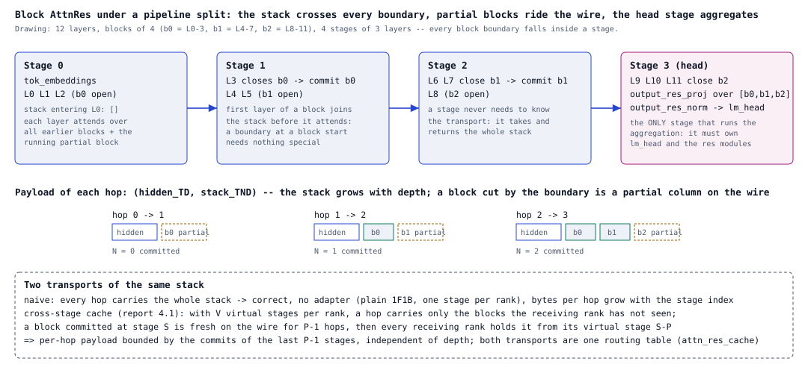
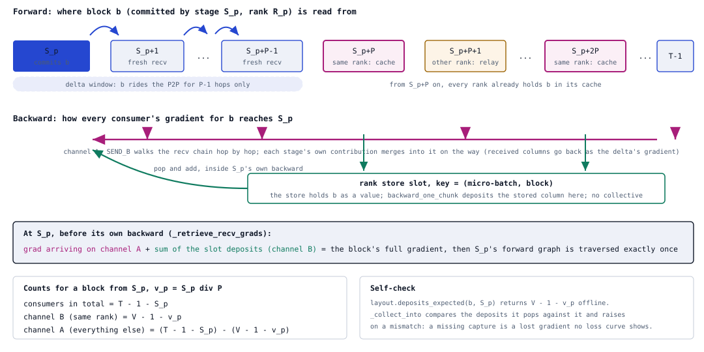
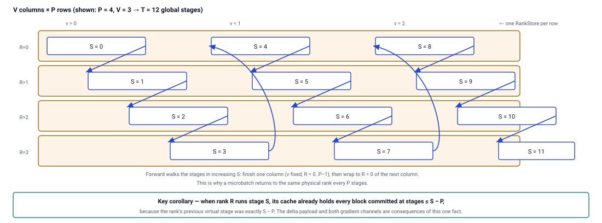
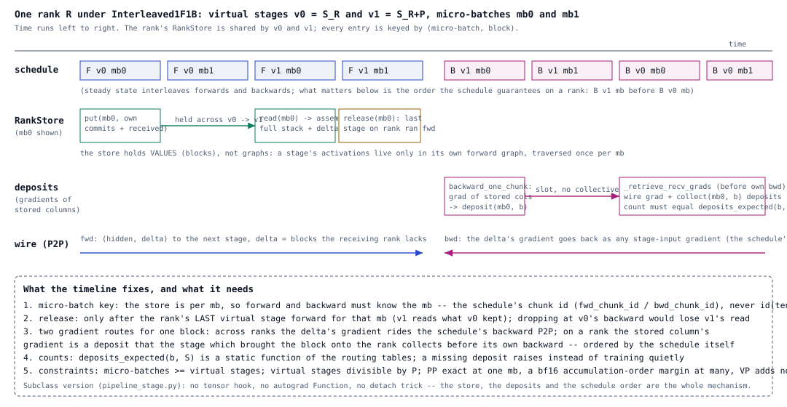
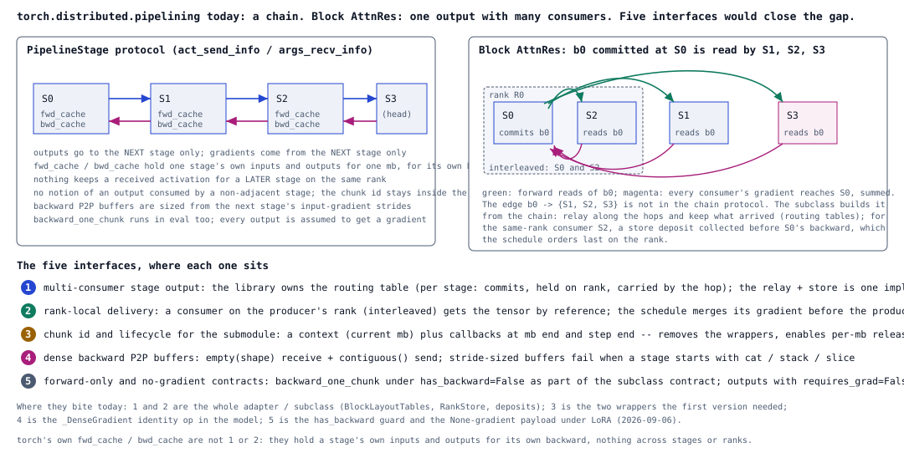

# Block Attention Residuals under pipeline parallelism: a second client for a model-owned pipeline runtime

Design note for the pipelining discussion (the talk the torchtitan team asked for, and the RFC). Written against #4486 (`PipelineResult` / `PipelineRuntime`, 2026-09-05) and `torch.distributed.pipelining` as of main `f6b9152e9`. The reference implementation is #4312 (`pipeline_adapter.py`, validated step-1 bitwise against one GPU from 2 to 32 stages, PP8 x VP4 on the irregular 33-layer debug model); this note is about the interface, not the adapter.

## 0. One page

```
Block AttnRes: every layer attends over ALL earlier blocks + the running partial block
    |
    v  split by layers into pipeline stages
R1  the block stack must cross every stage boundary with the hidden state
R2  the final aggregation (output_res_proj -> output_res_norm) runs only on the stage that owns lm_head
R3  the stack grows with depth; a boundary inside a block puts a partial block on the wire
    |
    +-- naive transport: send the whole stack every hop -> correct, bytes grow with the stage index
    +-- cross-stage cache: V virtual stages per rank; a hop carries only the delta the receiver lacks
            |
            v  three dependencies the chain protocol does not have
        (a) sender and receiver must agree on what a hop carries  -> routing tables, no metadata on the wire
        (b) the cache is per micro-batch                          -> a key that survives P2P (the schedule's chunk id)
        (c) a cached block's gradient returns from every later stage to the stage that committed it -> two gradient routes
            |
            v
        PipelineStage knows one protocol: outputs to the next stage, gradients from it.
        #4486 adds model-owned hooks for PARAMETERS replicated across stages.
        AttnRes needs the same idea for ACTIVATIONS consumed by several later stages.
```

## 1. The requirement, in #4486's terms

PR 4486 introduces the shape this problem needs: the pipeline builder returns a `PipelineResult` (schedule, local model parts, global virtual-stage indices, ownership flags, a `PipelineRuntime`), and the Trainer calls the runtime at four points: `synchronize_parameters` after init or load, `prepare_microbatch(inputs, kwargs)` while the micro-batches are assembled, `finalize_gradients` after every backward, `parameters_for_grad_norm` before clipping. Its first client is MTP: one parameter (the embedding) with a canonical copy on the first stage and a replica on the last, kept equal, gradients summed, counted once.

Block AttnRes is the second client, and the object is not a parameter. A block committed at stage $S$ is an activation that stages $S+1 \ldots$ consume, per micro-batch, with a gradient that has to return from each consumer to $S$. In the vocabulary of #4486: a multi-consumer stage OUTPUT with per-micro-batch lifetime, where the shared-parameter runtime has a single-owner PARAMETER with step lifetime. A placement on a tensor (the alternative raised in the #4486 review, `Owned` on several ranks) describes the parameter case exactly and the activation case not at all: the activation has no owner before the forward that creates it, and its consumers are decided by the layer split.

| requirement | why | where it lives today (#4312) |
| --- | --- | --- |
| the stack crosses every boundary | each layer attends over all earlier blocks | hop payload `(hidden_TD, delta_TND)`; the model takes and returns the whole stack and knows nothing of transport |
| aggregation only on the head stage | one aggregation over the whole stack | `kimi_k3_module_fqns_per_model_part` keeps the res modules with `lm_head` |
| partial blocks on the wire | a block's first layer joins the stack before it attends | `first_layer_in_block`; a boundary at a block start needs nothing special |
| irregular splits | K3 is 93 layers = 7 x 12 + 9; the debug flavor is 33 | routing built from the actual layer -> stage split, one `all_gather_object` |

Two transports share the routing behind one flag and are the A/B of every results table: naive sends the whole stack every hop (correct, no adapter, what plain 1F1B runs); the cached delta keeps a block committed at stage $S$ on the wire for $P-1$ hops, after which every receiving rank already holds it from its virtual stage $S-P$, so the per-hop payload is bounded by the last $P-1$ stages' commits and does not grow with depth.



Figure 1. 12 layers, blocks of 4, 4 stages: the payload per hop, and the two transports.

## 2. The lifecycle, mapped onto #4486's hooks

| adapter step (per micro-batch $m$, rank $R$, virtual stage $v$) | what it needs | #4486 hook | covered? |
| --- | --- | --- | --- |
| key the store by the micro-batch | the schedule's chunk id, not tensor identity (NCCL hands out fresh receive buffers) | `prepare_microbatch(inputs, kwargs)` runs per micro-batch while `kwarg_mbs` is built and can tag the kwargs | not as it stands: the hook carries no micro-batch index and no step boundary, and the trainer's metadata-inference pass calls it too, so a runtime counter drifts from the schedule's chunk id (measured: 8 at chunk 0 of step 1); the hook should receive the index, or the step start should be a hook |
| put: keep this stage's commits for the rank's later virtual stages | rank-local storage keyed by (m, stage) | none; today the `PipelineStage` subclass owns the store | no |
| read: assemble the stack from the store plus the received delta | the routing table (what the previous rank sent, what this rank holds) | `PipelineResult.stage_indices` and the stage -> rank map are the inputs of that table | partly: the map exists, the table and the assembly do not |
| send only what the next rank lacks | the same table on the sender | as above | partly |
| release after the rank's last virtual stage forward of $m$ | a per-micro-batch end callback | none (`finalize_gradients` is per step) | no |
| deposit: a consumer's backward leaves the gradient of a stored block in a slot | a slot keyed by (m, producing stage, commit index) | none | no |
| collect: the producer's backward reads the slot before it runs | ordering inside the schedule (later virtual stages' backward first, which every schedule already does) | none; `finalize_gradients` runs after all backward passes, too late | no |
| across ranks: the gradient of the delta rides the pipeline's own backward P2P | nothing new | the chain protocol | yes |
| count the expected deposits so a lost gradient raises | the table | none | no |

So #4486 nearly covers the key (suggestion 3 below: the hook needs the micro-batch index or a step-start hook) and covers the stage/rank map, and leaves the store, the routing table, the per-micro-batch release and the in-schedule gradient merge to the stage. Those four are the multi-consumer edge itself; they cannot be expressed as a parameter placement, and they cannot wait for a step-end hook.

## 3. What each problem forced (the design of #4312, condensed)

**Who holds what, without metadata on the wire.** A hop's payload depends on what the receiver already has, so both sides must agree on the columns before the first send. The layout tables are built once from the actual layer -> stage split and simulated offline on both sides; nothing about the payload travels with it.

**A micro-batch key that survives P2P.** Tensor identity does not survive the transport. The key has to come from the schedule; a stage subclass gets it as the argument of the call it overrides, `prepare_microbatch` can hand it to any submodule.

**The backward of a cached block.** A block committed at one stage is read by several later stages, so its gradient has to come back from all of them to the stage that committed it. Every general mechanism tried failed for a reason worth stating:

1. A custom collective inside `autograd.Function.backward` deadlocks: the engine is single-threaded and depth-first, the peer has not reached the matching Function, and the exchange races the schedule's own backward P2P.
2. Flushing the gradients after each micro-batch's backward deadlocks too: under interleaving, ranks reach a given micro-batch's backward at different times, so the P2P has no peer.
3. One batched exchange at step end removes the deadlock but keeps every micro-batch's graph alive until the step ends.
4. Letting the gradients ride the schedule's own backward P2P is correct across ranks and needs no new communication. It fails in one case: a block a rank commits at one virtual stage and reads back from its own store at the next, where the consumer's backward walks into the producer's graph and frees it a second time.
5. `retain_graph=True` fixes that case and gives up the memory PP exists to save; the cost grows with virtual stages and micro-batches.
6. Wrapping the same-rank hand-off in autograd Functions still double-fires when both ends land in one micro-batch's backward.

What works is to stop treating the cached block as a graph at all. The store holds VALUES, so a consumer's input has no upstream graph and every forward graph is traversed once per micro-batch; the gradient is deposited in a slot keyed by (micro-batch, producing stage, commit index) and collected by the stage that brought the block onto the rank, before its own backward -- an ordering every schedule already provides, since it runs the later virtual stages' backward first. Across ranks nothing is added: the gradient rides the pipeline's own backward P2P. The tables say how many deposits each block must receive, so a lost gradient raises instead of training silently.



Figure 2. The delta window (a block is fresh on the wire for $P-1$ hops) and the two gradient routes: the pipeline's own backward P2P across ranks, a store slot within a rank.



Figure 3. The looped assignment $S = v \cdot P + R$ (shown: $P=4$, $V=3$). A micro-batch walks the stages in increasing $S$, so it returns to the same rank every $P$ stages and that rank's store already holds every block committed at stages $\le S-P$. The delta window, the same-rank slot and its expected deposit count all follow from this.



Figure 4. One rank, virtual stages v0 / v1, micro-batch 0: put at v0's forward, read at v1's forward, release after the rank's last virtual stage forward; deposit at v1's backward, collect before v0's backward, ordered by the schedule.

The stage is a `PipelineStage` subclass: `forward_one_chunk` assembles the stack from the store plus the received delta, runs the stage, keeps its commits and sends only what the next rank lacks; `backward_one_chunk` reads the gradient of the assembled stack (a leaf the stage owns), returns the received columns as the delta's gradient and deposits the stored columns; `_retrieve_recv_grads` collects the deposits for the blocks this rank brought in, before their producer's backward. No hooks, no custom Functions, no detach tricks: the schedule's own ordering carries the design. One core hook makes it possible, `pipeline_llm(..., stage_class=...)`. PP is bitwise with no-PP at one micro-batch and differs by a bf16 accumulation-order margin at many (step 1: 4e-4 on the loss, 1.3 percent on the gradient norm); VP adds nothing (VP=1 and VP=4 bitwise).

## 4. What `torch.distributed.pipelining` and #4486 lack, and the suggestions

`PipelineStage` describes a chain (`act_send_info` / `args_recv_info`: outputs to the next stage, gradients from it), and its `fwd_cache` / `bwd_cache` hold one stage's own inputs and outputs for one micro-batch, for its own backward. Nothing keeps a received activation for a later stage on the same rank, and nothing routes a gradient to a non-adjacent producer. In order of value:

1. **Multi-consumer stage outputs.** The library owns the routing table (`BlockLayoutTables` is that table, computed outside it today) and decides per hop what travels and what is kept; the chain relay with a rank store is one implementation, bounded to the last $P-1$ stages' commits. `PipelineResult.stage_indices` plus the stage -> rank map are its inputs; a `PipelineRuntime` is a natural owner of the table and the store, if the runtime is given a per-micro-batch view.
2. **Rank-local delivery for same-rank consumers.** The schedule knows `stage_index_to_group_rank`; such an output can be handed over by reference and its gradient merged before the producer's backward, which the schedule already orders last on the rank (route B without a hook; the subclass proves the ordering is enough). This is the one piece that must live at schedule or stage level: a step-end `finalize_gradients` is too late.
3. **Chunk id and lifecycle for the submodule.** #4486's `prepare_microbatch` is the right place but carries no micro-batch index and no step boundary (the metadata-inference pass calls it as well, so a counter in the runtime drifts); pass the index, and add a micro-batch-end callback (release) next to the step-end one. Removes the two wrappers and enables per-micro-batch release.
4. **Dense backward P2P buffers.** `torch.empty(shape)` receive and `.contiguous()` before send; stride-sized buffers fail when a stage starts with a view op (`cat` / `stack` / slice on its input).
5. **Forward-only and no-gradient contracts.** `backward_one_chunk` under `has_backward=False` as part of the subclass contract; stage outputs with `requires_grad=False` get `None` rather than an assumed gradient.



Figure 5. Left: the chain protocol and its per-stage caches. Right: b0 committed at S0 read by S1 / S2 / S3, with S2 on S0's rank. The five suggestions where each bites.

## 4b. Transport: the multi-node hazard and what the design does about it

The old tree's pipeline carried per-micro-batch metadata (the block stack's shape changes with the stage) through `_send_meta` / `_recv_meta`, object P2P on the full PP NCCL group, and voted the inference mode through a serial P2P chain on the same group. On one node that never hung; on two GB200 nodes with eight stages under 1F1B it hangs at the late edges every time (`torchtitan#4281`, 2026-09-09): the metadata traffic and the tensor traffic share one communicator whose creation and op order the ranks reach in different sequences. The fix that unblocked it (`elfiegg:fix/pp8-neighbor-p2p-metadata`) moves metadata to a CPU Gloo group per PP replica, gives every edge its own two-rank NCCL group created before the mesh's other groups, and replaces the vote chain by one all-reduce.

This design has no metadata on the wire: the routing tables fix every hop's payload before the first send, so the stage runs STATIC and the schedule's own batched P2P is the only traffic. What remains is the runtime's own gap, written as a TODO in `schedules.py`: in STATIC mode the group communicator behind the mixed send/receive batch is created lazily at the first steady-state batch, and across nodes the late edges of an eight-stage pipeline can sit in that creation until the timeout. The entry therefore creates every edge communicator right after the schedule build (`_warmup_pp_edge_communicators`, the TODO's prescription applied from the trainer side, every rank entering at the same point). The same warm-up was already in the old tree Elfie tested and did not unblock it, which is consistent with the old tree's hazard being op ordering on one shared communicator (per-micro-batch blocking metadata P2P between the schedule's tensor batches, plus the serial vote chain) rather than creation timing; this design issues none of that traffic, so what the warm-up addresses is the whole of what remains. Single node: dp1 and pp2 bitwise with and without it; the two-node run is the pending validation. If the late edges still hang there, the per-edge groups are the next step, and the right owner is the runtime: the vote protocol already creates two-rank sub-communicators for the homogeneous path.

## 4c. The transport port (2026-09-10): two remedies, kept apart, so a two-node run can tell them apart

`pp_review4` = PR 4312's head + two commits in `torchtitan/distributed/` (483 insertions, 1 deletion; nothing in the model folder, the stage and its routing tables untouched):

- Default path, 35 lines (`_warmup_pp_edge_communicators`): right after the schedule build every rank runs the schedules module's own prescription for its STATIC-mode gap, `_get_init_p2p_neighbors_ops` + `_batch_p2p` with dummy payloads, so the group communicator behind the mixed send/receive batch exists before step one. This is the only change a user sees without opting in.
- Opt-in, 448 lines behind `TORCHTITAN_PIPELINE_NEIGHBOR_P2P=1` (`_NeighborP2PTransportMixin`, `_create_pipeline_transport_groups`, `_configure_neighbor_p2p_schedule`; `ParallelDims._create_pipeline_neighbor_groups`; the `device_id` binding in `init_distributed`): Elfie's isolation from `elfiegg:fix/pp8-neighbor-p2p-metadata`, composed as a mixin in front of `AttnResPipelineStage` rather than replacing it. Metadata (the runtime's one-time shape inference) goes over a CPU Gloo group per PP replica, every edge gets a two-rank NCCL group created in `ParallelDims` before the mesh's other groups (so it lands on `ncclCommSplit` through the bound device), and the inference-mode vote is one all-reduce MIN instead of a serial P2P chain. Two changes from her branch: edge groups are keyed by the sorted global-rank pair with the peer index looked up per edge, so looped schedules (Interleaved1F1B's `k*P-1 -> k*P` wrap) get their group too; and the stage subclass is composed, so the residual routing keeps running.

Why both, and why apart: the old tree's hang was op ordering on one shared communicator (per-micro-batch metadata P2P and the vote chain between the tensor batches), which is why the warm-up alone (`d1ec535d1`, in the branch Elfie tested) did not unblock it there. The new tree has no traffic outside the schedule's batches, so what can remain is exactly the TODO's creation-timing gap, which the warm-up closes. If two nodes and eight stages still hang with the default and pass with the switch, the runtime's mixed-batch path has a second problem the TODO does not describe, and that is worth a PyTorch issue on its own; if the default passes, the isolation stays an option and item 6 of the RFC reduces to "keep the hops STATIC and warm the edge communicators".

One node (8 x RTX 5060 Ti): pp2, pp8 plain 1F1B, pp8 x vp4 are bitwise identical with the switch on and off, and bitwise with the pre-port `k3_pp_text` head; the CPU test (`tests/unit_tests/cpu/test_pipeline_neighbor_transport.py`, 6 tests) covers the edge-group keying, the looped wrap, and the vote. The two-node run is the one measurement this box cannot make; it is the ask in `PP_TRANSPORT_NOTE_FOR_ELFIE.md`.

## 5. A split of work that fits #4486

- The team owns the abstraction: `PipelineResult`, the runtime hooks, and whether cross-stage activations are a runtime concern or a placement (this note's answer: activations need the runtime plus one schedule-level ordering guarantee; parameters can be either).
- AttnRes is the second client. What it brings, ready to be re-homed on whatever shape is chosen: the routing tables from an arbitrary split, the value store with deposit slots, the expected-deposit count as the correctness check, the stage subclass as the executable spec of the ordering, and the A/B against the naive transport at 2 to 32 stages.
- The mechanism-independent pieces of #4312 go in on their own: the block-residual stage split for irregular models, the dense-gradient stage input, the eval-schedule fix, the placeholder placement on the rank holding layer 0.
- #4312 stays as the reference implementation until the runtime shape is settled, then is rewritten on it.

## 6. Symptoms met on the way (for whoever builds the generic version)

| symptom | cause | fix |
| --- | --- | --- |
| every middle stage missed its cache | `id(tensor)` as the key; NCCL fresh buffers | the schedule's chunk id |
| NCCL watchdog timeout | custom P2P inside autograd / in a flush | the gradients ride the schedule's own backward P2P |
| "backward through the graph a second time" | a same-rank cached block still attached to the producer's graph | the store holds values, not graphs |
| memory grows with virtual stages and micro-batches | `retain_graph=True` as a stop-gap for the same-rank re-read | values in the store, deposits collected by the schedule's ordering |
| ranks with different topologies hang | the transport chosen by an environment variable, exported non-uniformly | an argument of the pipelining entry |
| even split only | interleaved ranks lack the global layer -> stage map | one `all_gather_object` (`PipelineResult.stage_indices` carries it now) |
| `Tensors for P2P must be non-overlapping and dense` | torch sizes the backward receive buffer from the next stage's input-gradient strides; a stage starting with cat / stack / slice yields view gradients | model-side `_DenseGradient`; upstream should allocate `torch.empty(shape)` and send `.contiguous()` |
| "no gradient arrived for the payload" under LoRA | nothing trainable upstream of the payload; the next stage has no gradient channel | `_retrieve_recv_grads` accepts `None`; deposits discarded |
| `KeyError: 0` in a forward-only log-prob pass | `schedule.eval` calls `backward_one_chunk` with backward off | honour `has_backward`, drop the chunk's bookkeeping |
| `KeyError` in the HF initial load on a stage | layer-0 placeholders shaped from layer 1, absent on that stage | place only on the rank holding layer 0, shape from the config |
| FSDP2 `_unsharded_param` on a text batch under PP | the no-reduce `post_backward` branch lacks the `hasattr` guard; a never-forwarded FSDP unit has no `_unsharded_param` | a text-only model has no tower; the guard is an upstream issue |
| step 10 spreads by percents | Adam's first step is `lr * sign(g)`; bf16 rounding flips 0.2 percent of elements and the descent amplifies it | step 1 and per-parameter gradients are the bar |

## 7. Talk outline (25 minutes)

1. What Block AttnRes asks of a pipeline: R1-R3 and Figure 1 (3 min).
2. Naive transport vs the cached delta: bytes per hop, the $P-1$ window (3 min).
3. The three dependencies the chain protocol lacks: routing agreement, the micro-batch key, the multi-consumer gradient (4 min).
4. Six mechanisms that fail and why; the value store and the schedule's own ordering (6 min, Figures 2-4).
5. #4486 as the home: what its hooks already give, what the stage must keep (Section 2's table) (4 min).
6. The five interface suggestions and a proposed split of work (3 min, Figure 5).
7. Numbers: step-1 bitwise from 2 to 32 stages, the accumulation margin at many micro-batches, the symptom table (2 min).
