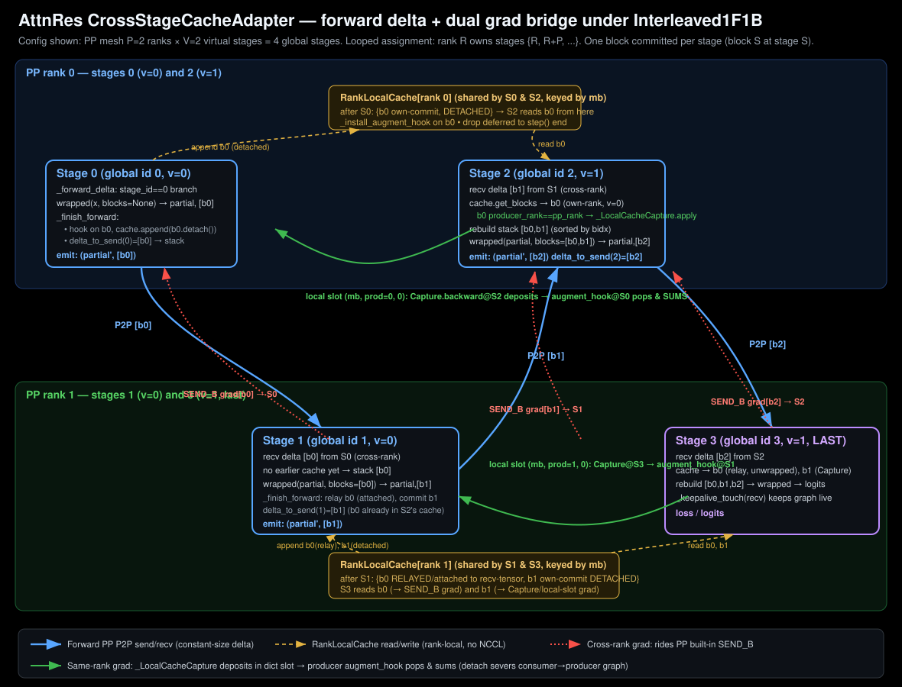

# Phase 3 PP Adapter — 实现原理与核心调用模式

> AttnRes `CrossStageCacheAdapter` 嵌入 torchtitan Pipeline Parallelism 的运行机制，
> Interleaved1F1B 下 PP mesh × VP stages 的前向 delta 与双梯度桥。

---

## 计算流程图



---

## 0. 它要解决什么问题

AttnRes（attention-residual）的每个 stage 会"提交"(commit) 一组 block，**后面所有 stage 都要 attend 到前面所有 block**。朴素 PP 下，stage `s` 必须把"截至目前累积的全部 block 栈"通过 P2P 发给 `s+1` —— 发送量随 stage id 线性增长（最后一跳要发 N 个 block）。

Adapter 的核心思想：**每个 rank 维护一个跨 virtual-stage 共享的 block 缓存，每跳只发接收方缓存里"还没有的" block（delta）**，接收方用「缓存前缀 + 收到的 delta」重建完整 block 栈。这样跨 stage 前向带宽变成**常量**（与 stage id 无关）。

代价是 backward 变复杂：一个 block 的梯度要从所有"消费它"的下游 stage 汇聚回"提交它"的 stage。Adapter 用**两条完全不同的梯度回传通道**解决（下面 §5 详述）。

---

## 1. 如何嵌入 torchtitan 的 PP 运行机制

torchtitan 的 `ModelSpec` 有一个可插拔的 `pipelining_fn` 钩子。AttnRes 实验把它替换成 `pipeline_llm_with_cache_adapter`（**零核心改动**，符合 "不要把实验泄漏进 core" 原则）。

`pipeline_llm_with_cache_adapter`（`pipeline_adapter.py:1048-1143`）做了 5 件事：

1. **先委托核心** `pipeline_llm`（L1061）拿到 `(pp_schedule, model_parts, has_first_stage, has_last_stage)` —— 真正的 stage 切分、schedule 构建仍由 torchtitan core 完成。
2. **三道 gate**：环境变量 `TORCHTITAN_ATTNRES_CACHE=1`（`adapter_enabled:89`）、schedule 必须是 `Interleaved1F1B`（L1071-1078，否则 warn 并退回朴素路径）、能找到 enabled 的 AttnRes config（L1092）。任何一道不过都返回未修改的 `passthrough`。
3. **离线构建静态布局表** `_infer_block_layout_tables_from_stages`（L1108）—— 见 §3。
4. **包裹每个 stage 的 submod**：把 `stage.submod` 换成 `CrossStageCacheAdapter(stage.submod, ...)`（L1121-1133），同时同步 `model_parts[i]`（给 optimizer/compile 用）。
5. **安装两类 monkey-patch**：每个 stage 的 `_install_mb_index_patch`（L1132）和 schedule 级的 `_install_step_drop_patch`（L1141）。

> ⚠️ **注意**：设计文档 `adapter_design.md` 描述的是**旧版** grad 协议（`_SendBlockGradsBack`/`_RecvBlockGradsFromConsumers` 用 NCCL `isend/irecv`）。**实际代码已经演进**：跨 rank 梯度改走 PP 内建的 `SEND_B`，同 rank 梯度改用纯本地 dict slot 桥。以代码 docstring 为准。

---

## 2. Interleaved1F1B 下的 PP mesh × VP stages 映射

这是理解整个 adapter 的地基。Interleaved1F1B 是 `PipelineScheduleMulti`：**每个物理 rank 持有 V 个 virtual stage**（"looped" 切分）。

**核心约定（贯穿全代码）**：全局 stage id `S` 与物理 rank `R`、virtual index `v` 的关系是

```
R = S % P        v = S // P
rank R 拥有 stages {R, R+P, R+2P, ..., R+(V-1)P}
```

出现在三处：`layout.py:178`、`pipeline_adapter.py:1086` 的 `stage_to_rank = {s: s % pp_size ...}`、以及 VP drop-guard L836。

**图中的具体例子 P=2, V=2**（4 个全局 stage，每 stage 提交 1 个 block）：

- rank 0 = stages {0, 2}，rank 1 = stages {1, 3}
- 前向 zigzag：S0(r0) → S1(r1) → S2(r0) → S3(r1)
- 这恰好同时覆盖了两种梯度通道：
  - **同 rank**：S0 提交的 b0 被 S2（同在 rank0）从缓存读取 → 本地 slot 桥
  - **跨 rank**：S0 的 b0 通过 P2P 发到 S1（rank1）→ SEND_B 桥

关键事实（`layout.py:252-254`）：`Interleaved1F1B` 的 `pp_schedule._stages` **只返回本 rank 的 V 个 stage**，所以 `len(stages) == V`，而 `stage.stage_index` 是**全局** id。`num_stages = pp_size * len(stages)`（L1085）。

---

## 3. 静态布局表 BlockLayoutTables —— 元数据永不上线

`layout.py:24-231`。给定 `(P, V, num_blocks, n_layers, layers_per_block)`，它**离线、确定性地模拟一遍单 microbatch 的完整前向**（`_build:148`），materialize 出几张查表：

| 方法 | 含义 | 代码 |
| --- | --- | --- |
| `commits_at(S)` | stage S 提交哪些 block | L103 |
| `delta_to_send(S)` | S 向 S+1 实际发送的 block 子集 | L109 |
| `rank_cache_at_entry(R,v)` | rank R 的第 v 个 virtual stage 进入时缓存里有哪些 block | L106 |
| `producer_stage_of_block(b)` | block b 由哪个 stage 提交 | L112 |
| `expected_same_rank_captures(S, i)` | 有多少个**同 rank 的后续 virtual stage**会从缓存读这个 block（= 应有多少次 Capture 存入） | L122 |

`delta` 的计算就是一行集合差（L193）：`delta = sorted(accumulated - receiver_cache)` —— 已累积的所有 block 减去接收方缓存已有的。**因为两端都跑同一张静态表，发送顺序和接收解包顺序天然一致，不需要任何 metadata 上线**。

---

## 4. 核心调用模式（一）：前向 delta

入口 `CrossStageCacheAdapter.forward:568`，三路分发：

- 若当前没有 mb index（`_current_mb_index is None`）→ `_forward_shape_inference`（L579）。因为 `PipelineStage._shape_inference` 会**绕过** `forward_one_chunk` 直接调 `submod`，此时要按 runtime 将发出的 delta 尺寸 reshape 输出，好让下游正确分配 recv buffer（L592-600）。
- delta 模式 → `_forward_delta`
- 否则 → 朴素全栈 passthrough

**`_forward_delta`（L602-704）的步骤**（对照图中的 S2/S3）：

1. **stage 0 特例**：`wrapped(x, blocks=None)`，无 recv（L620-624）。
2. **解包收到的 delta**：`recv_list = unstack_blocks(recv_delta_tensor)`（`attn_res.py:151`，是 zero-copy view，保 autograd），按发送方 `delta_to_send(stage-1)` 的顺序对齐（L632-637，带 size 断言）。
3. **从共享缓存取更早的 block**（L657-680）—— 这里按 producer 是否在本 rank 分两种包裹方式（§5 详述）。
4. **重建完整 block 栈**：缓存块 + delta 块，按 canonical block index 排序后 `torch.stack`（L682-691）。
5. **调 wrapped model**：`wrapped(partial, blocks=blocks_tensor)`（L693）。wrapped 的 `_return_only_new_blocks=True`（L502 构造时翻转），所以只返回**本 stage 新提交**的 block。
6. **尾部**：last stage 走 `_keepalive_touch`（L697，把 recv tensor 焊在 autograd 图上，否则它没有下游会被当成不需要梯度）；中间 stage 走 `_finish_forward`。

**`_finish_forward`（L706-811）** 做三件事：把 relay 来的 block 入缓存（L728-737，仍 attach 在 `prev_recv_tensor` 上）；把本 stage 新 block 入缓存（L757-772，**detached**，并装 augment hook）；按 `delta_to_send(S)` 拼出本跳要发的 delta（L783-809）。

---

## 5. 核心调用模式（二）：双梯度桥 ★整个设计最精妙处★

一个 block 的梯度要从"消费它的所有下游 stage"汇回"提交它的 stage"。按 producer 与 consumer 是否同 rank，走两条完全不同的路（L466-473）：

### 通道 A — 跨 rank：搭 PP 内建 SEND_B 顺风车（图中红色虚线）

缓存里 producer 在**别的 rank** 的 block，是某个旧 `recv_delta_tensor` 的切片，**原封不动不包裹**（L679-680）。它的 autograd 图本来就连回那个 recv tensor，PP 的 `SEND_B` 会自动把梯度沿前向用的同一条 stage 链一跳跳送回 producer rank。**零 NCCL 额外代码、零死锁风险（PP 独占所有 NCCL）**（L34-38）。

### 通道 B — 同 rank：本地 dict slot 桥（图中绿色实线）

缓存里 producer 在**本 rank**（更早 virtual stage 提交）的 block。这里有一个致命的 autograd 陷阱（L250-267）：

> 若不干预，consumer 的 backward 会经由 rebuild 的 stack/cat 梯度路径**走进 producer 的前向图并把它 free 掉**；之后 producer 自己的 backward（从 SEND_B 来）再想遍历同一张图就会崩 "backward through the graph a second time"。

解法是**结构性切断 + 旁路搬运**，三个部件：

1. **存入时 detach**（`_finish_forward:769-772`）：缓存里存的是 `blk.detach()`。这是**承重保证** —— consumer 物理上无路可走进 producer 的图。
2. **读取时包 `_LocalCacheCapture`**（L672-678）：consumer 把 detached 叶子 `requires_grad_(True)` 后过一遍 `_LocalCacheCapture.apply`。它前向是 identity（`forward:377`），**backward 把 grad 存进 dict slot 然后返回 None 停下**（`backward:386-389`）。slot key = `(mb, producer_stage, block_idx)`。
3. **producer 端 tensor grad hook**（`_install_augment_hook:297`）：在 producer 提交 block 时给它挂一个 hook。当 producer **自己的 backward** 跑到这个 block（从 outgoing-delta 路径来），hook 触发，`pop_grad` 取出 slot 里 consumer 存的梯度，**SUM 进 incoming grad**（`_hook:339-358`）再往 producer 的 wrapped model 传。

> **为什么不能用 `_LocalCacheAugment` autograd.Function？** docstring 明确记录（L259-267、L317-323）：在真实 PP+FSDP+selective-AC-rerun 下，Function 返回 input 的 view **挡不住** autograd 从 consumer 的 Capture 节点上溯进 producer 前向图 —— 实测能观察到 producer 的 backward 在 *consumer* 的 `backward_one_chunk` 里被触发。只有 tensor-grad-hook + detach 这对组合才结构性地杜绝（见 `handoff_status_20260420_part3.md`）。

**正确性自检**：`expected_same_rank_captures`（`layout.py:122`）静态算出应有几次 Capture 存入；hook 触发时比对实际 count，不符就 warn（L346-355）—— 把"某 consumer 的 backward 没跑导致静默丢梯度"变成显式告警。`on_microbatch_end`（L845-876）在本 rank 最早 virtual stage（其 backward 最后跑）断言所有 slot 都已被 pop 干净。

---

## 6. 核心调用模式（三）：mb-index 穿线 与 step-end 清理

**为什么需要穿线**：缓存按 microbatch 分桶，但 autograd hook 在 backward 时触发，那时 adapter 怎么知道当前是哪个 mb？答案：schedule 拥有的整数 `chunk_id`。

`_install_mb_index_patch`（L897-960）monkey-patch 每个 stage 的 `forward_one_chunk`/`backward_one_chunk`，进入时把 `fwd_chunk_id`/`bwd_chunk_id` 存到 **per-(stage,adapter) 的 thread-local**（`_set_mb_index:406`），退出时清掉。因为**前向和反向在同一线程同步跑**，backward 期间触发的 hook 能读到正确 mb（L45-51）。整数 key 跨 P2P 稳定（不像 tensor 的 `id()`）。还要兼容 torch 2.9（无 `save_forward_output` kwarg）vs nightly（L911-926）。

**清理**：`backward_one_chunk` 结束调 `on_microbatch_end` 仅**标记** mb seen（L956），不立刻 drop（共享缓存对同 rank 其他 virtual stage 还活着）。真正驱逐由 `_install_step_drop_patch`（L963-986）包裹 `pp_schedule.step`，在 step 返回后统一清。**VP drop-guard**（`_drop_all_seen_and_clear:826-843`）：只有本 rank**最后一个** virtual stage（`stage_id + P >= num_stages`）才真正释放，早的 virtual stage no-op，保证共享缓存对它们仍在。

---

## 7. 代码位置速查表

| 关注点 | 位置 |
| --- | --- |
| pipelining_fn 入口 / gates / 安装 | `pipeline_adapter.py:1048-1143` |
| 前向 delta 主逻辑 | `_forward_delta:602` |
| 入缓存 + 拼 outgoing delta | `_finish_forward:706` |
| 同 rank 梯度桥（detach + Capture + hook） | L297-389, L669-680 |
| 共享缓存数据结构 | `RankLocalCache:96` |
| mb-index 穿线 patch | `_install_mb_index_patch:897` |
| step-end + VP drop-guard | L826-843, L963 |
| 静态布局表 / delta 算法 | `layout.py:148-197` |
| PP×VP 映射 `R=S%P, v=S//P` | `layout.py:178`, `adapter:1086` |

---

## 一句话总括

> Adapter 把 "AttnRes 全栈广播" 重写成「**每 rank 共享缓存 + 每跳只发 delta**」的常量带宽前向；前向元数据靠双端共跑的**静态布局表**对齐（零上线）；反向则把梯度拆成**跨 rank 搭 PP-SEND_B 顺风车** 和 **同 rank 走 detach+Capture+hook 本地 dict slot 桥** 两条互不干扰的通道，从而每个 stage 的前向图恰好被遍历一次、peak 内存等于朴素 PP baseline —— 且全部通过 `pipelining_fn` + monkey-patch 实现，**零核心改动**。
